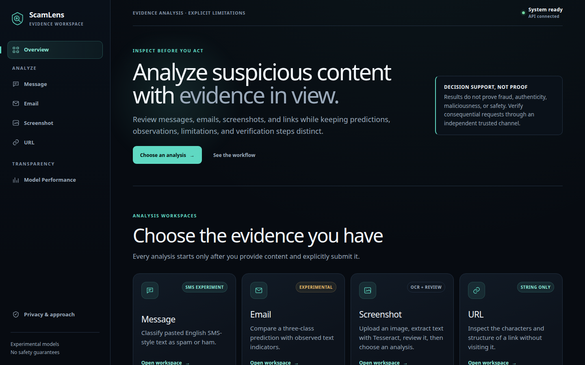
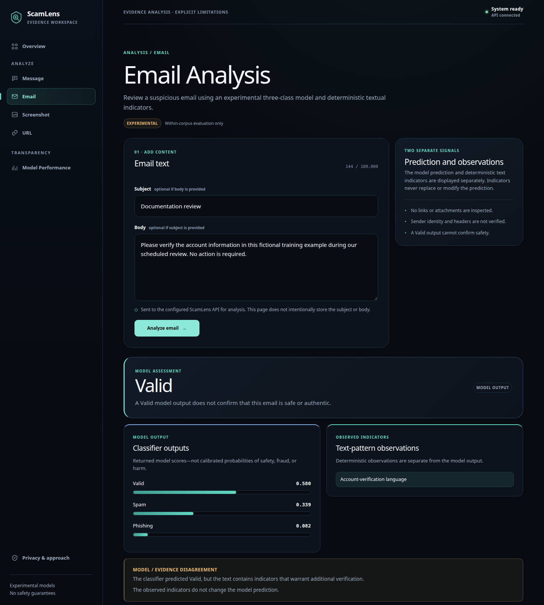
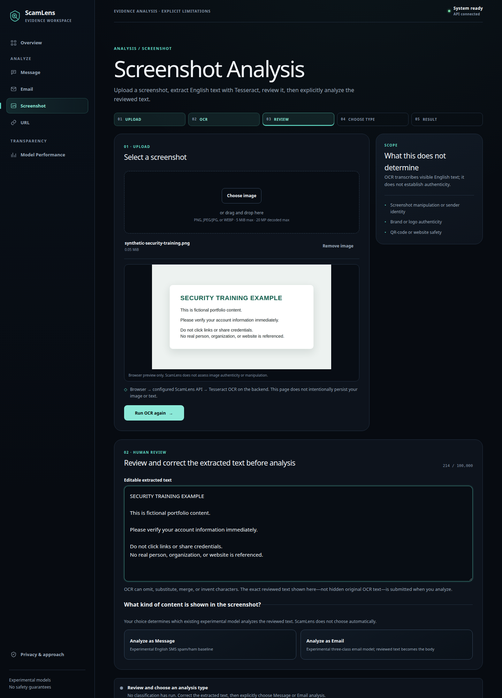
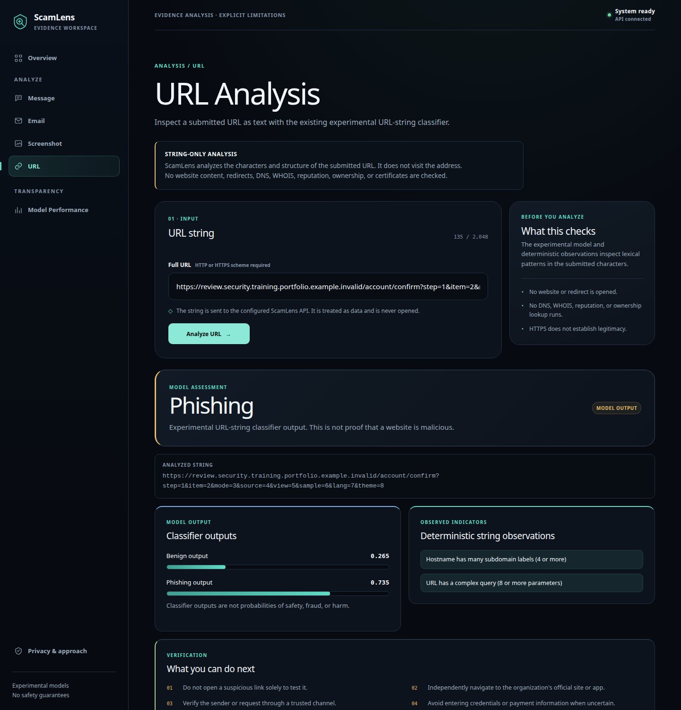
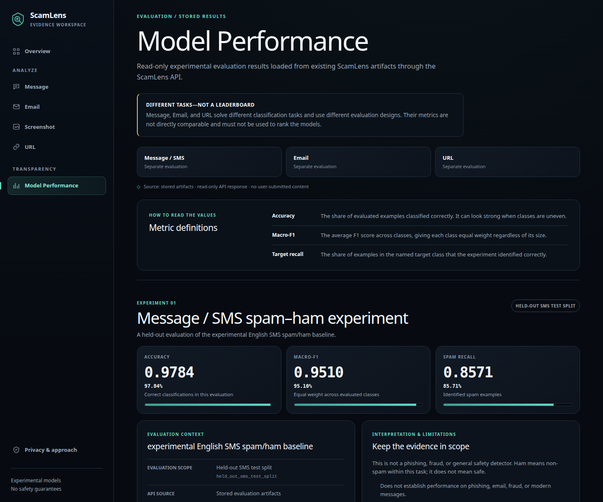

# ScamLens

ScamLens is a local evidence-review application for examining submitted messages, emails, screenshots, and URL strings through separate experimental ML and OCR pipelines.

It demonstrates an end-to-end Computer Science and machine-learning workflow: provenance-aware dataset preparation, leakage-conscious evaluation, local scikit-learn inference, a typed FastAPI service, and a responsive Next.js interface. Predictions are presented alongside directly observed indicators, limitations, and independent verification guidance.

ScamLens supports investigation and verification. Its results are not proof of fraud, authenticity, maliciousness, or safety, and the application does not produce an overall safety verdict.

## Application Preview

[](docs/assets/screenshots/scamlens-overview.png)

| Email analysis with model/evidence disagreement | Screenshot OCR with explicit human review |
| --- | --- |
| [](docs/assets/screenshots/scamlens-email-disagreement.png) | [](docs/assets/screenshots/scamlens-screenshot-ocr-review.png) |

| URL string-only analysis | Stored experimental model performance |
| --- | --- |
| [](docs/assets/screenshots/scamlens-url-string-analysis.png) | [](docs/assets/screenshots/scamlens-model-performance.png) |

## Capabilities

- **Message Analysis** classifies pasted English SMS-style text as spam or ham using an experimental model trained on the UCI SMS Spam Collection. Ham means non-spam within this task; it does not mean safe.
- **Email Analysis** produces a three-class `Valid`, `Spam`, or `Phishing` model prediction and reports deterministic text observations separately. Its evaluation is limited to its source corpus.
- **Screenshot Analysis** validates a PNG, JPEG/JPG, or WEBP image, extracts English text locally with Tesseract, and presents editable text for review. Classification occurs only after the user explicitly chooses Message or Email Analysis.
- **URL Analysis** evaluates the literal URL string with a character-based classifier and deterministic structural observations. ScamLens never visits the submitted destination.
- **Model Performance** displays read-only metrics from the three stored experimental evaluations, with their scopes and limitations kept visible.

## Architecture

The Next.js, React, and TypeScript frontend provides the six application routes and validates user input before calling a typed FastAPI API. Pydantic schemas enforce backend request and response contracts. The API then routes each explicit request to a separate processing path:

- message text to the local SMS model;
- email subject and body to the local email model and deterministic observations;
- screenshots to local Tesseract OCR, followed by user review and an optional explicit text-analysis request;
- URL strings to local lexical inference and deterministic structural observations; or
- the performance view to stored aggregate evaluation results.

Model inference and OCR run locally with trusted project-controlled artifacts. URL Analysis performs string parsing and inference only: it makes no request to the submitted URL and performs no HTTP, DNS, WHOIS, reputation, certificate, ownership, domain-age, redirect, or page-content lookup.

> **Architecture diagram placeholder**
>
> Future location for a diagram of the browser, Next.js frontend, FastAPI boundary, separate ML/OCR paths, local artifacts, and blocked URL-to-Internet path.

## ML Methodology

### SMS spam/ham experiment

The message pipeline is an experimental English SMS spam/ham classifier trained on the historical UCI SMS Spam Collection. It combines word TF-IDF features with Logistic Regression. Exact duplicate messages and detected near-duplicate components are kept within a single partition; model and threshold selection use validation data before evaluation on the held-out test split. The corpus predates modern messaging patterns, and spam/ham labels do not establish phishing, fraud, or safety performance.

### Email Valid/Spam/Phishing experiment

The email pipeline is a three-class word TF-IDF and Logistic Regression baseline trained on redacted subject and body text from the English anchor of the Mendeley dataset. Translation variants are excluded, normalized duplicate groups remain within one partition, and model selection uses validation macro-F1 before a single test evaluation. This is a within-corpus experiment: real-world, source-independent, and user-independent generalization is not established.

### URL phishing/benign temporal experiment

The URL pipeline uses character 4–6-gram TF-IDF features and balanced Logistic Regression on a URL-only subset of PhreshPhish v1.0.1. Selection uses a later validation period with registered-domain separation from the earlier training pool, followed by evaluation on a filtered official temporal test. Domain overlap, collection-time and source confounding, possible label noise, temporal drift, and weak diagnostic subsets limit generalization claims.

Email and URL workspaces also report deterministic observations derived directly from submitted text. These observations remain separate from model predictions and are never combined into an overall risk or safety score.

## Evaluation

The stored project artifacts support the following results:

| Experiment | Evaluation scope | Accuracy | Macro-F1 | Target-class recall |
| --- | --- | ---: | ---: | ---: |
| English SMS spam/ham | Held-out 835-row UCI SMS test split | 0.9784 | 0.9510 | Spam: 0.8571 |
| Email Valid/Spam/Phishing | Within-corpus 776-row test split | 0.9536 | 0.8855 | Phishing: 0.7612 |
| URL phishing/benign | Filtered 166,494-row official temporal test | 0.9249 | 0.9237 | Phish: 0.8695 |

These experiments use different datasets, labels, and evaluation designs. Their metrics are not directly comparable and must not be combined into an overall ScamLens accuracy. Classifier outputs are not calibrated probabilities of fraud, authenticity, maliciousness, or safety.

## Engineering Highlights

- Typed TypeScript client contracts and Pydantic API schemas validate response shapes and reject unexpected fields.
- Frontend and backend validation enforce limits of 5,000 message characters, 100,000 combined email characters, 2,048 URL characters, and 5 MiB/20 decoded megapixels for screenshots.
- Client requests have mode-specific timeouts, and editing input invalidates prior or in-flight results so stale responses cannot overwrite newer content.
- Loading states and disabled submission controls prevent duplicate submissions through the interface.
- The development API provides process-local, in-memory rate limiting, with a lower limit for OCR than text inference.
- OCR has a fail-fast per-process concurrency limit of two, runs outside the asynchronous event loop, and retains a 15-second server-side Tesseract timeout.
- Client-facing failures are normalized so internal paths, stack traces, and backend details are not displayed.
- CORS uses explicit configured origins rather than a wildcard.
- Browser tests verify that URL Analysis does not request submitted destinations and does not render them as clickable links.
- The application does not intentionally persist or log submitted messages, emails, URL strings, screenshots, or OCR output, and the frontend includes no analytics or tracking. Reverse proxies, hosting platforms, operating systems, and custom logging remain outside this application-level privacy boundary.

These are bounded application and development safeguards, not production-grade security or capacity claims.

## Technology Stack

| Area | Technologies |
| --- | --- |
| Frontend | Next.js, React, TypeScript |
| Backend | FastAPI, Pydantic, Uvicorn |
| ML and data | scikit-learn, pandas, NumPy, SciPy, joblib |
| OCR and images | Tesseract, pytesseract, Pillow |
| Testing and quality | pytest, Vitest, Testing Library, Playwright, ESLint, TypeScript |

## Run Locally

### Prerequisites

The verified development baseline uses Python 3.12.3, Node.js 22.23.2, npm 10.9.8, and Tesseract 5.3.4 with English language data. Install Tesseract and its English language package through the appropriate system package manager.

The repository is source-only. Read [Source-Only Repository](#source-only-repository) before setup: model-backed analysis and stored performance routes require authorized local artifacts that are not included in a clean clone.

### Install dependencies

From the project root, create a Python environment and install the pinned dependencies:

```bash
python3 -m venv .venv
.venv/bin/python -m pip install -r requirements.txt
```

Install the locked frontend dependencies:

```bash
cd frontend
npm ci
cd ..
```

Review [`.env.example`](.env.example) for backend configuration. Development defaults work on loopback unless environment-specific values are needed. Copy the frontend example when overriding its defaults:

```bash
cp frontend/.env.example frontend/.env.local
```

### Start FastAPI and Next.js

Start the backend from the project root:

```bash
.venv/bin/python -m uvicorn scamlens.api.app:app --host 127.0.0.1 --port 8000
```

In a second terminal, start the frontend:

```bash
cd frontend
npm run dev
```

Open `http://localhost:3000`. Local OpenAPI documentation is available at `http://127.0.0.1:8000/docs`.

### Legacy local interface

The earlier Streamlit interface remains available independently:

```bash
.venv/bin/python -m streamlit run app.py
```

Streamlit normally prints a loopback URL such as `http://localhost:8501`.

## Source-Only Repository

Raw datasets, processed datasets, trained model artifacts, and the stored evaluation artifacts used by the performance endpoint are intentionally excluded from version control. A clean source-only clone can inspect the implementation, install dependencies, and run checks that do not require those files, but it cannot provide all model-backed analysis, readiness, or Model Performance functionality without authorized local artifacts or legally regenerated equivalents.

This repository does not provide an alternate or implied dataset/model download route. Consult the [dataset provenance](docs/DATASET_PROVENANCE.md), [model provenance](docs/MODEL_PROVENANCE.md), and [licensing review](docs/LICENSING_REVIEW.md) before any redistribution or publication decision.

## Quality Checks

Run the backend test suite from the project root:

```bash
.venv/bin/pytest -q
```

The backend tests cover API contracts, request safeguards, validation, local inference behavior, data and split logic, OCR, URL analysis, and production-control configuration.

Run frontend unit/component tests, browser E2E tests, linting, TypeScript checks, and the production build from `frontend/`:

```bash
cd frontend
npm test
npm run test:e2e
npm run lint
npm run typecheck
npm run build
```

Vitest and Testing Library exercise client configuration, API handling, workspaces, routes, and UI states. Playwright covers all six routes, validation, loading and stale-response behavior, sanitized errors, URL no-fetch behavior, responsive layouts, keyboard navigation, reduced motion, and automated accessibility checks. ESLint and TypeScript perform static checks; the Next.js build verifies the production compilation path.

The Playwright configuration uses an installed Google Chrome browser and deterministic intercepted API responses. The test command does not install browser binaries or contact submitted URL destinations.

## Documentation

- [Dataset methodology and experiment design](docs/DATASETS.md)
- [Dataset provenance and rights status](docs/DATASET_PROVENANCE.md)
- [Trained model provenance](docs/MODEL_PROVENANCE.md)
- [Email model card](docs/EMAIL_MODEL_CARD.md)
- [Production considerations](docs/PRODUCTION.md)
- [Third-party notices](docs/THIRD_PARTY_NOTICES.md)
- [Licensing review](docs/LICENSING_REVIEW.md)

The SMS and URL model cards are stored beside their local artifacts and are therefore not part of a source-only clone.

## Limitations

- ScamLens contains separate experiments, not one unified detector, and produces no overall safety verdict.
- The SMS model uses a historical spam/ham corpus and does not establish performance on phishing, fraud, email, or modern messages.
- The email model is evaluated within one source corpus; real-world, source-independent, and user-independent generalization is not established.
- The URL model evaluates lexical URL content only. Dataset overlap, confounding, label noise, temporal drift, and weak diagnostic subsets limit broader conclusions.
- OCR is English-only and can omit, substitute, merge, or invent text; users must review extracted content before analysis.
- ScamLens never fetches a submitted URL, so it cannot assess the current destination, page content, redirects, infrastructure, ownership, or reputation.
- The repository does not represent public deployment or dataset/model redistribution rights as resolved.
